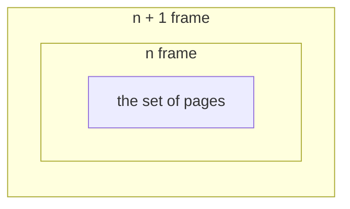

# My Algorithms

My algorithms collections

## Terms

- Stack algorithm: the set of pages in memory for `n` frames is always **a subset** of the set of pages that would be in memory with `n + 1` frames

## References

-  https://github.com/TheAlgorithms/Javascript
-  https://chengr4.medium.com/algorithm-notes-graph-1798ae2e5bcb
-  https://chengr4.medium.com/algorithm-nodes-b5166a825c68
-  [李耕銘; STL 的排序演算法 (2021.11)](https://lkm543.medium.com/stl-%E7%9A%84%E6%8E%92%E5%BA%8F%E6%BC%94%E7%AE%97%E6%B3%95-9e31de7f83b4)
-  [Algorithm and Data Structure CheetSheet](https://gist.github.com/chengr4/bd8c60545b24aad8e3359202f8f083af)
- [CS 514, Algorithms, Spring 2025](https://web.engr.oregonstate.edu/~huanlian/teaching/alg/2025spring/)
- https://web.engr.oregonstate.edu/~huanlian/slides/COLING-tutorial-anim.pdf
