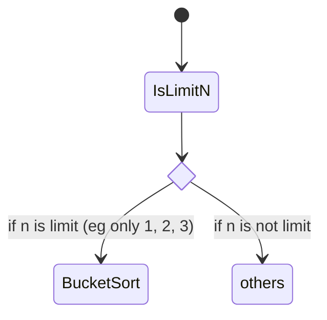

# Sorts

## Features

1. Quick sort 在大資料時，排序最快 (Quick Sort > Merge Sort > Heap Sort)
> 執行時還必須考量到 Compare、Swap、Recursion 的次數
2. 小資料時 Insertion Sort 最快 (Insertion Sort > Quick Sort > Merge Sort ~ Heap Sort)
3. Quick sort 為不穩定排序
4. Merge sort 需要額外的 memory O(n)

> 所以 C++ STL 使用 introsort: 
> 原則上使用 Quick Sort => 
> Recusive 深度大於 log(n) 改用 Heap Sort =>
> 資料小於20筆改用 Insertion Sort

## 

## Merge Sort

Time complexity:

if `x >= 2`

`$$ T(n) = 2T(n/2) + O(n) $$`

`$$ =>  O(nlogn) $$`

> Find the proof on YT if forgetting how to proof

## Quick Sort

- 若 pivot 為 max, min => worse case O(n^2)

## Bucket Sort

- Put elements into buckets (a range)
- Go though each of buckets and put everything in order

## Topology Sort

> See Leetcode 269

## References

1. [Bucket Sort](https://youtu.be/ELrhrrCjDOA)
2. [CS Dojo; A Complete Overview of Quicksort (Data Structures & Algorithms #11) (2020.08)](https://youtu.be/0SkOjNaO1XY)
